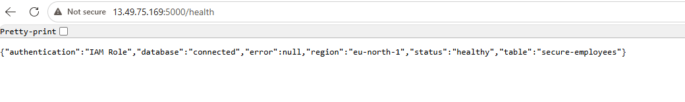
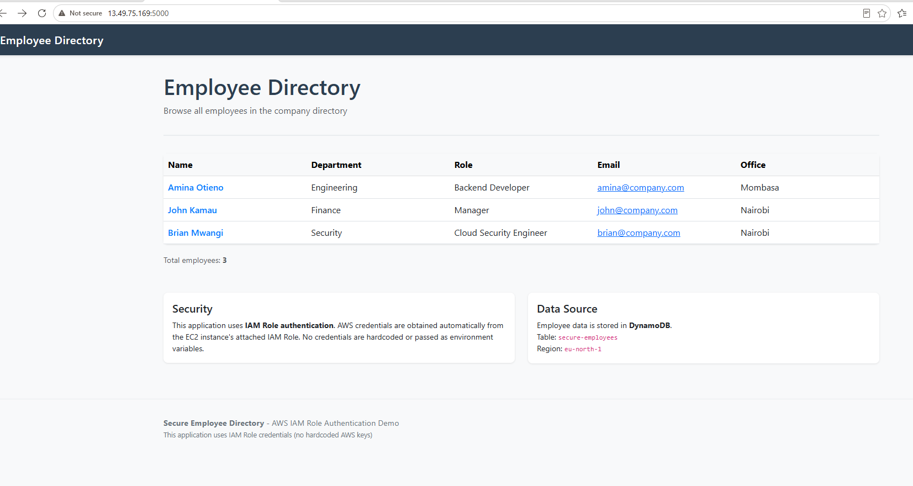
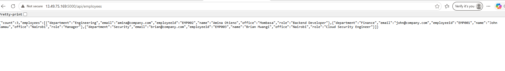
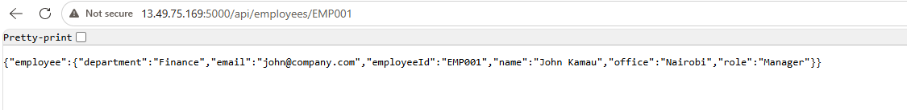
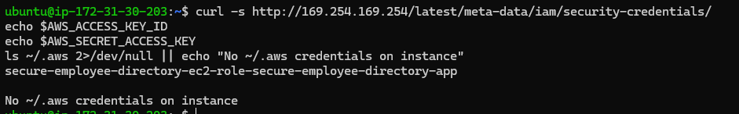
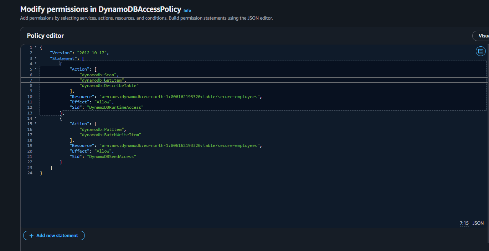

# Secure Employee Directory

Python Flask backend demonstrating the AWS best practice of allowing an EC2 instance to access DynamoDB through an IAM Role instead of long-term AWS access keys.

## Project Goal

The application reads employee records from a DynamoDB table and serves them through HTML pages and JSON API endpoints. In AWS, authentication must come from the IAM Role attached to the EC2 instance. No AWS credentials should be hardcoded, committed, or configured with `aws configure`.

## Demo Evidence

Live deployment proof that the EC2 app reads DynamoDB using an IAM Role (no access keys on the instance).

### Health check — IAM Role authentication

`GET /health` reports a healthy app, connected DynamoDB, and authentication via IAM Role:



### Employee directory (HTML)

The home page lists employees from DynamoDB:



### REST API

All employees:



Single employee by ID:



### No long-term credentials on EC2

Instance metadata shows the attached role. Access key env vars are empty and `~/.aws` is not present:



### Least-privilege IAM policy

The instance role policy allows only the required DynamoDB actions on the `secure-employees` table ARN:



Demo command checklist: [docs/demo-commands.md](docs/demo-commands.md).

## Architecture

- Flask application factory in `app/__init__.py`
- Routes separated into web and REST API blueprints
- DynamoDB access isolated in `app/services/dynamodb_service.py`
- Employee domain model in `app/models/employee.py`
- Environment-based configuration in `app/config.py`
- Centralized logging in `app/utils/logger.py`
- Tests use fakes/mocks instead of real AWS resources

## Folder Structure

IAM-least-previlege-backend/
├── app/
│   ├── routes/
│   ├── services/
│   ├── models/
│   ├── templates/
│   ├── static/css/style.css
│   ├── utils/
│   ├── __init__.py
│   └── config.py
├── docs/
│   ├── images/
│   │   ├── Browser.png
│   │   ├── api-all-employees.png
│   │   ├── api-single-employee.png
│   │   ├── health-check.png
│   │   ├── iam-policy.png
│   │   └── no-aws-credentials-on-instance.png
│   ├── api.md
│   ├── demo-commands.md
│   ├── dynamodb-handoff.md
│   ├── ec2-iam-handoff.md
│   └── alb-https-handoff.md
├── infrastructure/
│   ├── dynamodb.yaml
│   ├── ec2-iam.yaml
│   └── alb-https.yaml
├── scripts/
│   └── populate_table.py
├── tests/
│   ├── conftest.py
│   ├── test_routes.py
│   └── test_services.py
├── Dockerfile
├── requirements.txt
├── run.py
├── .env.example
└── README.md
```

## DynamoDB Contract

Table name defaults to `secure-employees`.
Region defaults to `eu-north-1` (must match the team DynamoDB table).

Required schema:

- Partition key: `employeeId`
- Attributes: `name`, `department`, `role`, `email`, `office`

Example item:

```json
{
  "employeeId": "EMP001",
  "name": "John Kamau",
  "department": "Finance",
  "role": "Manager",
  "email": "john@company.com",
  "office": "Nairobi"
}
```

## Environment Variables

Copy `.env.example` to `.env` for local development if needed.

```text
FLASK_ENV=development
SECRET_KEY=your-secret-key-here-change-in-production
PORT=5000
HOST=0.0.0.0
AWS_REGION=eu-north-1
DYNAMODB_TABLE_NAME=secure-employees
LOG_LEVEL=INFO
```

Do not set `AWS_ACCESS_KEY_ID` or `AWS_SECRET_ACCESS_KEY` for the AWS challenge deployment. On EC2, boto3 should use the instance profile credentials from the attached IAM Role.

Production tips:

- Set `LOG_JSON=true` so Gunicorn/stdout logs are CloudWatch Logs Insights friendly.
- Set `TRUST_PROXY=true` when the app sits behind an Application Load Balancer (HTTPS termination).
- Prefer `/health/ready` for ALB target health and `/health/live` for process liveness.

## Local Development

Create a virtual environment:

```bash
python -m venv .venv
```

Activate it and install dependencies:

```bash
pip install -r requirements.txt
```

Run the app:

```bash
python run.py
```

Open:

- `http://localhost:5000/`
- `http://localhost:5000/health`
- `http://localhost:5000/api/employees`

Local runs still need AWS credentials from boto3's provider chain if they access a real DynamoDB table. For this challenge, production EC2 should use the IAM Role.

## Populate Sample Data

After the infrastructure team creates the DynamoDB table and attaches the correct IAM Role to the EC2 instance:

```bash
python scripts/populate_table.py
```

The script uses boto3's default credential provider chain and does not configure or accept access keys.

## Tests

```bash
pytest
```

The tests do not call AWS. They use fake services and fake DynamoDB table objects to validate routing, health output, pagination behavior, and the `employeeId` data contract.

## Docker

Build:

```bash
docker build -t secure-employee-directory .
```

Run:

```bash
docker run --rm -p 5000:5000 \
  -e FLASK_ENV=production \
  -e SECRET_KEY=change-me \
  -e AWS_REGION=eu-north-1 \
  -e DYNAMODB_TABLE_NAME=secure-employees \
  secure-employee-directory
```

In AWS, prefer running on EC2 with an instance profile IAM Role. If this container runs on ECS instead, use an ECS task role.

## IAM Role Requirements

The EC2 instance role should follow least privilege. For this app, read-only runtime access needs:

- `dynamodb:Scan`
- `dynamodb:GetItem`
- `dynamodb:DescribeTable`

If running `scripts/populate_table.py`, the role also needs:

- `dynamodb:BatchWriteItem`
- `dynamodb:PutItem`

Scope permissions to the specific DynamoDB table ARN created by CloudFormation.

Deploy EC2 + the least-privilege instance role with:

```bash
# See docs/ec2-iam-handoff.md for full steps
aws cloudformation deploy \
  --template-file infrastructure/ec2-iam.yaml \
  --stack-name secure-employee-directory-app \
  --parameter-overrides \
    DynamoDBTableArn=YOUR_TABLE_ARN \
    VpcId=vpc-xxxxxxxx \
    SubnetId=subnet-xxxxxxxx \
    KeyPairName=YOUR_KEY_PAIR \
  --capabilities CAPABILITY_NAMED_IAM \
  --region eu-north-1
```

## API Documentation

See [docs/api.md](docs/api.md).

## Troubleshooting

`NoCredentialsError`:

- Confirm the app is running on the intended EC2 instance.
- Confirm an IAM Role is attached to the instance.
- Do not use `aws configure` for this challenge.

`AccessDeniedException`:

- Confirm the role policy allows the required DynamoDB actions.
- Confirm the policy resource ARN matches the table.

`ResourceNotFoundException`:

- Confirm `DYNAMODB_TABLE_NAME`.
- Confirm `AWS_REGION`.
- Confirm CloudFormation created the table successfully.

## HTTPS / ALB with Route 53
HTTPS is configured via an Application Load Balancer with an ACM certificate and automated DNS validation through Route 53. The stack handles everything automatically with no manual DNS record creation required.

Check [docs/alb-https-handoff.md](docs/alb-https-handoff.md) for the setup.

**Architecture Overview**
```
Browser
  │
  ├── HTTP :80  ──► ALB ──► 301 redirect to HTTPS
  │
  └── HTTPS :443 ─► ALB (TLS terminated with ACM cert)
                      │
                      ▼
              Target Group (health check: GET /health/ready → 200)
                      │
                      ▼
              EC2 Instance :5000 (Flask / Gunicorn)
                      │
                      ▼
                  DynamoDB (via IAM Instance Profile)

```

### Key Features

- Automated DNS validation — ACM certificate validates automatically via Route 53
- Zero manual steps — no CNAME records to create manually
- Automatic renewal — ACM auto-renews certificates before expiry
- Route 53 alias record — (optional) automatically points your domain to the ALB
- TLS 1.2+ enforced — ELBSecurityPolicy-TLS13-1-2-2021-06 policy
- HTTP to HTTPS redirect — 301 redirect, browsers cache it
- EC2 port 5000 only accessible from ALB security group

### Getting the Route 53 Hosted Zone ID

```
# List all hosted zones
aws route53 list-hosted-zones --region eu-north-1

# Example output:
# HOSTEDZONES  employees.yourdomain.com.  /hostedzone/ZXXXXXXXXXXXXX

# Copy just the ID: ZXXXXXXXXXXXXX (without /hostedzone/)
```


## Future Improvements

- Add CloudFormation outputs documentation once infrastructure is finalized.
- Add CI workflow for linting, tests, and Docker build.
- Wire ALB target-group health checks to `/health/ready` (or `/health/live` for liveness-only).
