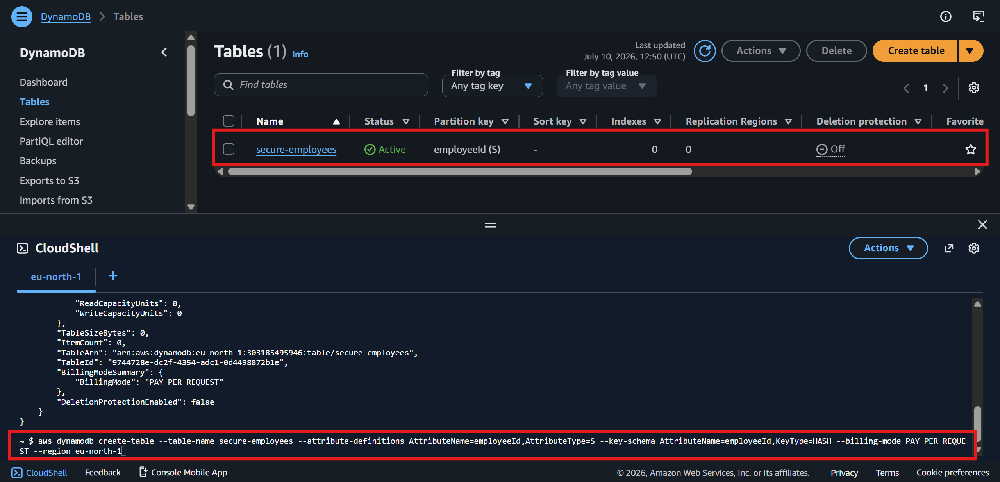

# DynamoDB - Secure Employee Directory



## Table Details

| Field         | Value                                                                        |
|---------------|------------------------------------------------------------------------------|
| Table Name    | `secure-employees`                                                           |
| Region        | `eu-north-1`                                                                 |
| Partition Key | `employeeId` (String)                                                        |
| Billing Mode  | On-Demand (PAY_PER_REQUEST)                                                  |
| ARN           | `arn:aws:dynamodb:eu-north-1:ACCOUNT_ID:table/secure-employees`         |
| Status        | Active                                                                       |

> **Note:** The real ARN has been shared with the IAM team directly. `ACCOUNT_ID`
> is omitted from this public document intentionally.

## How the Table Was Created

The table was provisioned via the AWS Management Console.
The only attribute declared at creation time is the partition key - DynamoDB is
schemaless, so the remaining attributes are written to the table automatically
when `scripts/populate_table.py` runs.

Creation command for reference:

```bash
aws dynamodb create-table \
  --table-name secure-employees \
  --attribute-definitions AttributeName=employeeId,AttributeType=S \
  --key-schema AttributeName=employeeId,KeyType=HASH \
  --billing-mode PAY_PER_REQUEST \
  --region eu-north-1
```

**Key schema notes:**
- `AttributeType=S` - data type of `employeeId` is String
- `KeyType=HASH` - `employeeId` is the partition key

## Item Schema

Each employee record contains the following attributes:

| Attribute    | Type   | Description                            |
|--------------|--------|----------------------------------------|
| `employeeId` | String | Partition key                          |
| `name`       | String | Employee full name                     |
| `department` | String | Department name                        |
| `role`       | String | Job title                              |
| `email`      | String | Email address                          |
| `office`     | String | Office location                        |

## For the IAM..

The EC2 instance role policy must be scoped to the table ARN (shared directly).
Without the ARN, the policy defaults to `"Resource": "*"` which means the role can perform those DynamoDB actions
on any table in the account. It'll work functionally but it violates least privilege; which 
is literally thhe point of this project.

Once the IAM Role is attached to the EC2 instance, the populate script can be ran
from the project root to seed the table with sample employees:

```bash
python scripts/populate_table.py
```

The app authenticates exclusively via the attached IAM Role.

